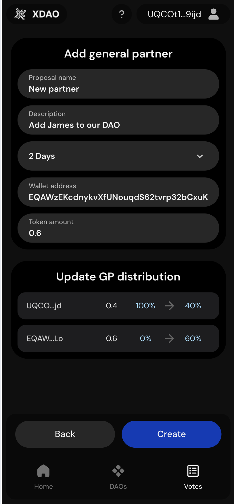
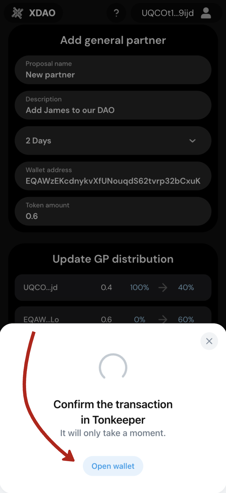

# Creating a Proposal

This guide will walk you through the process of creating a new proposal in your DAO. Follow these steps to submit your proposal for community voting.

## Step 1: Navigate to the Votes Page

First, you need to access the voting section of the application.

1. Open your DAO application
2. Locate the bottom navigation panel
3. Tap on the **"Votes"** tab

<figure style="margin: 20px 0; max-width: 300px;"></figure>

You'll see existing proposals and the option to create a new one.

## Step 2: Press the Green Button

Once you're on the Votes page, you can begin creating your proposal.

1. Look for the green button (typically labeled "Create Proposal")
2. Tap the green button to start the proposal creation process

<figure style="margin: 20px 0; max-width: 300px;"></figure>

## Step 3: Select DAO and Voting Type

You'll need to specify which DAO and what type of voting you want to create.

### Select Your DAO
Choose the appropriate DAO from the available options if you're a member of multiple DAOs.

### Choose Proposal Type
Select the type of proposal that best fits your needs:

- **Add General Partner** - Add a new member with voting rights
- **Remove General Partner** - Remove an existing General Partner
- **Transfer GP Tokens** - Transfer General Partner tokens between members
- **Change General Consensus** - Modify voting requirements or consensus rules
- **Send DAO Funds** - Propose spending from the DAO treasury
- **Change DAO Name** - Update the name of your DAO

## Step 4: Fill in All Required Fields

Complete all the necessary information based on your selected proposal type. The exact fields may vary, but typically include:

### Common Fields
- **Proposal Title**: A clear, concise title for your proposal
- **Description**: Detailed explanation of what you're proposing and why
- **Voting Duration**: How long the voting period should last

### Type-Specific Fields
Depending on your proposal type, you may need to provide:

- **Partner Address**: For adding/removing General Partners
- **Token Amount**: For transfer proposals
- **New Consensus Rules**: For governance changes
- **Recipient Address**: For fund transfers
- **Amount**: For financial proposals
- **New DAO Name**: For name change proposals

**Important**: Make sure all required fields are completed accurately as proposals cannot be edited once submitted.

## Step 5: Sign the Transaction

The final step is to authorize the proposal creation with your digital signature in your wallet.

1. Review all the details of your proposal carefully
2. When you're ready to submit, tap the "Submit" or "Create Proposal" button
3. Your wallet application will open automatically
4. Review the transaction details in your wallet
5. Confirm and sign the transaction with your digital signature
6. Wait for the transaction to be processed on the blockchain

## After Submission

Once your proposal is successfully created:

- Other General Partners will be able to see and vote on your proposal
- You'll receive notifications about voting activity
- Voting will end when either:
  - The required number of votes is reached
  - The voting deadline expires

## Important Notes

- **Only General Partners** can create and vote on proposals
- Proposals cannot be edited once submitted
- Make sure you have sufficient tokens in your wallet to pay for transaction fees
- Consider discussing your proposal with other members before submitting to increase chances of approval

## Voting Process

After your proposal is created, other General Partners can:

1. View the proposal details
2. Cast their votes (Yes/No or other options depending on proposal type)
3. See real-time voting results
4. Discuss the proposal with other members

The proposal will be automatically executed if it receives the required consensus according to your DAO's governance rules.
